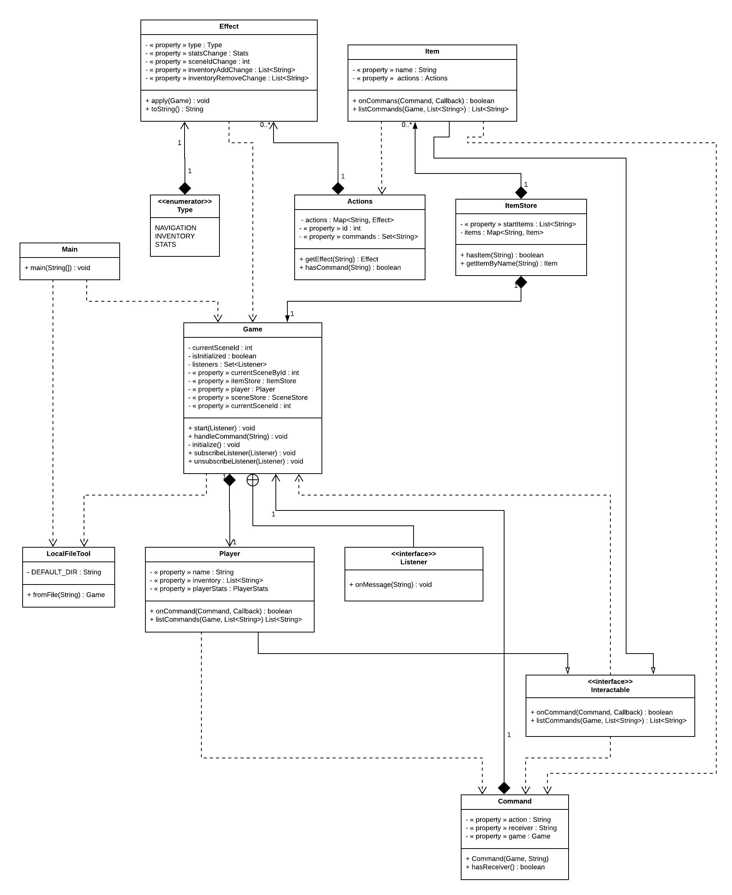
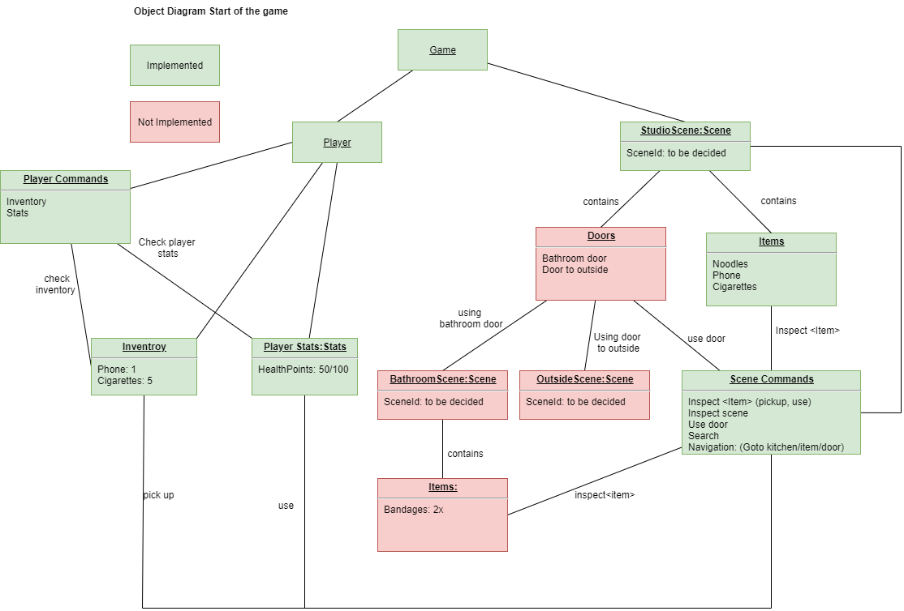
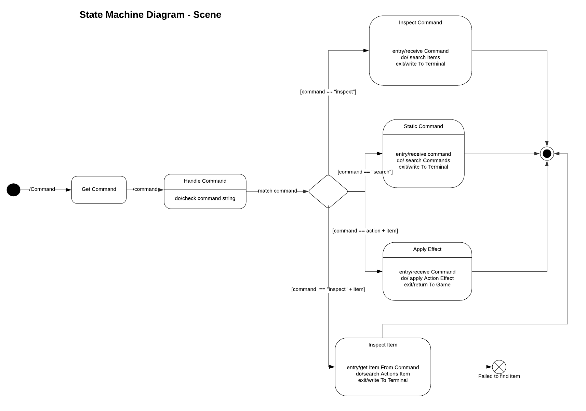
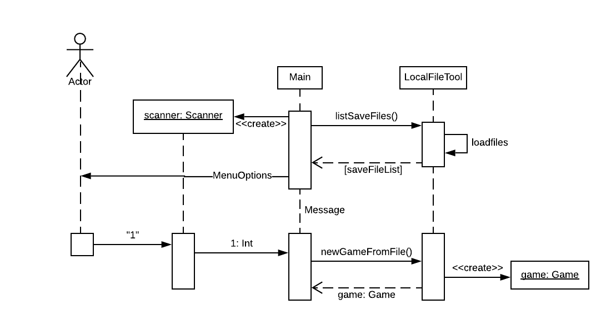
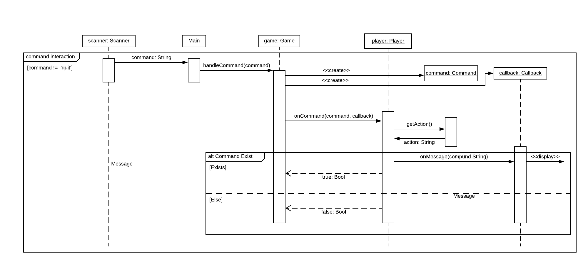
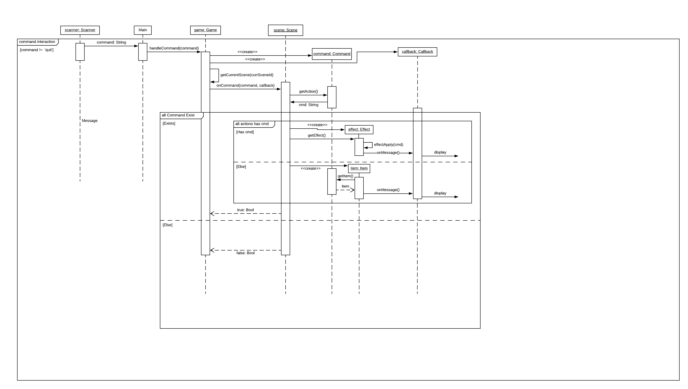

# Assignment 2

Maximum number of words for this document: 9000

Word Count: 4602

**IMPORTANT**: In this assignment you will model the whole system. Within each of your models, you will have a *prescriptive intent* when representing the elements related to the feature you are implementing in this assignment, whereas the rest of the elements are used with a *descriptive intent*. In all your diagrams it is strongly suggested to used different colors for the prescriptive and descriptive parts of your models (this helps you in better reasoning on the level of detail needed in each part of the models and the instructors in knowing how to assess your models).

**Format**: establish formatting conventions when describing your models in this document. For example, you style the name of each class in bold, whereas the attributes, operations, and associations as underlined text, objects are in italic, etc.

### Implemented features

<table>
<tr>
<th>ID</th>
<th>Short Name</th>
<th>Description</th>
</tr>
<tr>
<td>F1</td>
<td>Commands</td>
<td>Game shall have a <b>text-based option system</b>, where the player can type different commands in a command prompt which will result in different
actions(F3).</td>
</tr>
<tr>
<td>F2</td>
<td>Interface</td>
<td>The game shall be played inside a <b>command prompt</b>. Everything is text. Some scenarios should have ASCII art.</td>
</tr>
<tr>
<td>F3</td>
<td>Actions</td>
<td>Typing <b>different commands shall result in different actions</b> in the game sceneStore, examples of such are:
    <ul>
    <li>Movement</li>
    <li>Attacking</li>
    <li>Conversation</li>
    <li>Interacting with items (doors, keys, picking up items)</li>
    <li>Dying (restarts the game)</li>
    <li>Healing</li>
    <li>Examining items and surrounding</li>
    <li>Sleeping</li>
    </ul>
</td>
</tr>
</table>

### Used modeling tool
Class Diagram: LucidChart \
Sequence Diagram: LucidChart \
State Machine Diagrams: LucidChart\
Object Diagrams: Draw.io\
Implementation: Intellij IDEA

## Class diagram
Author(s): Sofia Konovalova

This diagram represents the class diagram for this UML project.

The **Main** class is self-explanatory - it is the main function of the entire program. The main method of this class creates a *game* object which uses
the **LocalFileTool** class to load the game from a json file. The json file includes all of the necessary information about the game: the scenes of the game
(a.k.a. the game states), and information about the scenes: the possible actions, characters, and items. \
**LocalFileTool** has the attributes *MAIN_DIR*, *GAME_DIR*, *SAVE_DIR*, *mainItemFile*, *mainSceneFile*, and *mainActionsFile*. The first three attributes are
static variables describing the user's main directory, the directory of where the game file is saved, and the directory of the save file of the game.
Th function *fromFile(String)* takes in the name of the main game file as a string, and conerts that into information the game can use. The function
*makeNewGameFromFile(ClassLoader)* makes a new game from the resource files that are included with the game. *makeNewGameFromFile(ClassLoader, File)* creates a new
game from a json file that may be provided by the user. *listSaveFiles()* lists the save files that are available to the user to play from. \
The **LocalFileTool** class and the **Game** class have a bidirectional association, as the **Game** class looks to **LocalFileTool** to define its attributes,
while **LocalFileTool** creates the game object, hence the *<<create>>* attribute in the line describing the relationship.

The **Game** class is the most important class of the game. It determines the current game state, which has all the necessary information like the scenes,
items in the scene, the players, and the actions available in the game state. It has the following attributes: *listeners*, which is a Set of action listeners,
*actionsMap*, which is a Map that associates an ID with an action, *currentSceneById*, which the unique ID of the current scene of the game we are in, a.k.a. the game
state, *sceneMap* which is Map that associates the unique scene IDs with a *Scene* object, and *itemMap*, which is a Map that associates a String name of an item
with the *Item* object. This class has constructors *Game(String, Map<Integer, Scene>, Map<Integer, Actions>, Map<String, Item>)* and
*Game(String, Map<Integer, Scene>, Map<Integer, Actions>, Map<String, Item>)*, which the only difference between them being the String parameter, which determines
the name of the player. If not included, then the default name that is included in the game files is used. These constructors use the GSON library to construct
the *Action*, *Item* and *Scene* objects and create their respective Maps. The class also has the functions *start(Listener)*, *handleCommand(String)*, *subscribeListener(Listener)*,
and *unsubscribeListener(Listener)*, which handles the commands that the player types into the console using Listeners which come with the standard Java library,
by making use of callback functions that are provided by the *Interactable* interface.

The **Command** class can be thought of as a sort of "parser" for the commands that the player writes in the terminal when they are playing the game.
The **Command** class has the following attributes: *action* and *receiver*, which are both of type *String*, and *game*, which is a *Game* object. The atrribute
*action* states the action that the user has written, e.g. "inspect", the *receiver attribute describes the receiver of a particular action, e.g. "inspect phone"
has the action "inspect" and the receiver "phone". The *game* attribute is the current game state. \
The class has a constructor, *Command(Game, String)* which takes the command that the user has typed into the console, and splits it into the three attributes
listed above. The appropriate getters and setters for each of the attributes are used. \
Above, we have written that the class can be thought of as a "parser" of sorts for the commands. The class that actually handles these commands
is the interface **Interactable**. The classes **Player**, **Items** and **Actions** are all realizations of **Interactable**, as they use in some way
the functions within the interface to handle to different commands that apply to the player, items in the game, and actions that a player can take in a scene. \
The **Interactable** interface defines two methods, which deal with command handling within the game. It has an interface named **Callback** which deals
with outgoing messages in the CLI during gameplay. The *listCommands(Game)* lists the possible commands that can be written by the player at a particular
game state.

The **Actions** class has the attributes *commands*, which is a Set of strings of actions commands, and *id*, which is a unique id of the scene that comes
after an action command is written to the console. Since the **Actions** is a realization of the interface **Interactable**, it has the functions *onCommand(Command, Callback)*
and *listCommands(Game, List<String>)* which handle the commands to decide what the game should do next should the player enter an action command, and which
prints out the list of possible action commands in a scene respectively. It also has a function *getEffect(String)* which returns an object of the class *Effect*,
which is preceisly what determines the effect of an action on a player. For example, one action could increase health points and another one decrease them. The
*hasCommand(String)* function checks if the command that the player has type actually exists, and returns a boolean. The **Action** class has a dependency relationship
with *Effect*, as actions are only useful and make the game playable if there is some sort of consequence to them. \
The **ActionStore** acts similarly to the **SceneStore** class, containing only the *actionsList* attribute which is a List of *Actions* objects, and the function
*toIntegerActionMap()*, which creates a hash map between a unique ID of the scene and the actions that are available in that scene. \
The *Effect* class handles the effects of each of the action. One of the most important aspects of the class is that is has an enumerator named *Type*, which determines
the type of effect that an action has -- the attributes of the enumerator are *NAVIGATION*, *INVENTORY*, *STATS*, which determine that an action can have an effect on the
navigation through the world (the player moving from one place to another), on the inventory (picking up an object), or on the stats of the player (sleeping increasing health
points, smoking cigarettes decreasing them). The *Effect* class itself has the attributes *sceneIdChange*, which determines the unique ID of the next scene to go to
if the effect is navigation, *statsChange* which is a **Stats** object that determines any changes to the stats of the player, *inventoryAddChange* which is a List of things to
add to the player's inventory, and *inventoryRemoveChange* which determines whic objects needs to be removed from the player's inventory, for example, if they have already used them.
The method *apply(Game)* applies the necessary changes to the current game state, which is represented by a *Game* object.

The **Scene** class defines the actions that are possible at a given time, the items that are in each scene, and the description of the scene itself.
It handles commands that are scene-specific, such as "search" or "inspect". The class has the attributes *items*, which is a list of items available in the scene,
*actions*, which is an *Actions* object which specifies the actions that can be taken in the scene, the *name* string, *description* string, and the unique *id*
integer of the scene. It has the same *onCommand(Command, Callback)* and *listCommands(Game, List<String>)* that is also present in the **Actions** class. This is because
actions, scenes and items are all interactable, and therefore need these functions to decide what to do when a certain command is typed in. \
The **SceneStore** class stores the list of *Scene* objects *scenesList*, and the ID of the starting scene, *startSceneId*. The function *toIntegerSceneMap()*
creates a hash map between the unique ID and the *Scene* object itself.

The **Item** class describes the items that are available in the scenes. It has the attributes *name*, *description*, and *actions*, which is an *Actions* object
which determines which actions are available with this particular item. It has the functions *onCommand(Command, Callback)* and *listCommands(Game, List<String>)* which
use the **Interactable** interface as items are interactable within the game and need to be handled appropriately. \
The **ItemStore** class acts as the same companion as **ActionStore** does to **Action** and **SceneStore** to **Scene**, containing a List of *Item* objects, and
a function *toStringItemMap()* which creates a hash map of the name of the objects to the *Item* object.

In the first version of our class diagram, the only "store" class that we had was **ItemStore**, as it made logical sense that items are stored somewhere,
while actions and scenes were just existing. Unfortunately, this led to a much more confusing plan, with a lot of dependencies which we knew would cause problems
in making the gameplay independent of the actual game. Before implementing the **ActionStore** and **SceneStore** classes into our models, we had one game file.
After implementing them, we now have three game files, one with the scenes, one with the items and one with the actions. This allows the code to be more modular
and easy to modify in the future, should there be any future changes and improvements. There was also no real clear hierarchy, making the structure of the game
and how classes interact with each other difficult to understand. Some of the relationships have changed since then -- for example, Game and Command don't
have a composition relationship anymore, but rather a binary association, as a game state has commands, and commands change the game state, so they both reliant
on each other equally. This made more sense for the structure of the game and also made more logical sense.

You can find the first version of our class diagram below:

The **Player** class contains all of the information about the user, and therefore, the player of the game. It contains a *playerStats* object, which sets
the health points, the name and the inventory of the player. The constructor sets all these values from the information takes from the **PlayerStats** class
with the approperiate getters and setters for each of the attributes. It also has a *onCommand(Command, Callback)* function which handles all the commands
that are related to health and inventory. The *listCommands()* function lists all of the  possible commands that the user can type to provide information about
their progress, such as "stats" and "inventory". The **Player** and **PlayerStats** classes have a composition relationship, with **Player** being composed and contained by
the **PlayerStats** class. As we can see in the class diagram, **Player** takes on the association with the multiplicity value of 1, and it is the same vice versa.
This means that a player can only contain one object of *playerStats*, and vice versa, as a player cannot have multiple health points values or multiple inventories. \
The **PlayerStats** class describes the stats that the player currently has, as well as setting them up in the beginning. The class has the following attributes:
*minHealthPoints*, *maxHealthPoints*, and *healthPoints*. Respectively, these attributes describe the minimum amount of health points the user can have in
the game before dying, the maximum amount of health points he can have at any point in the game, and the amount of health points that the user starts out
with. There are getters and setters for getting this information. There is also a *toString()* method that is overriden from the origin Java function so that
the stats can be printed on the console should the user type the correct command. The **PlayerStats** inherits from the **Stats** cass. \
The **Stats** class has a protected attribute *healthPoints*, the getter ans setter methods for that attribute, as well as printing out the stats using
the *toString()* method. The reason for the inheritance is the possibility of NPCs in the game sharing certain stats with the player, like health points.
When these NPCs are added, those classes can inherit from the **Stats** class to encourage code re-usability.

Word Count: 1977

## Object diagrams
Author(s): Koen van den Burg

This Object diagram captures the snapshot of the very beginning of the game. \
The green color means that the object is implemented in the system and the red color means the object is not implemented yet. \
The most fundamental objects are already implemented in the system: the *game*, *player*, *scene*, *inventory* and *player statistics*. \
Only the *door* object needs to be implemented to create the working text based adventure game which is desired. Besides the *doors*, more *scene* and *items* must be created in order to create a story line for the game.
In the diagram there are 2 *scenes* and one *item* object in red, these will be improved upon with more additional objects.
The *game* object starts the game in the *studio scene*, where there are a few available *commands* for the *studio scene* itself. \
There are multiple *commands* which can be used to interact with certain objects inside the *studio scene*. There should be two *doors*, one to the *bathroom scene* and one to the *outside scene*, this is not implemented yet. \
The player can use *scene commands* in order to navigate towards the *door*/*item* or other object and type a certain *command* to *use*/*inspect*/*navigate* towards/*search* the object. Depending on the type of object a different effect will occur. \
The scenes contain certain *items*, which can be interacted with using *commands*. The player can use  the *Inspect <item>* command to interact with an item like picking it up and adding it to the *inventory* or using it which will result in a change in the *player’s stats*, for now it will only increase of decrease the players’ *health points*. \
The *doors* can be used with a *command*, which should result in changing the current *scene ID* and result in the player heading into the next *scene*, thus progressing in the game.
The player can use the *command* *Inspect Scene* to receive more information about the interactable objects inside the *scene* they are in, in the *studio scene* that is the two *doors* and the items. \
The *player* object is connected to the *stats* object which hold the amount of *health points*, which are 50 out of the *maximum health points*: 100.  \
Using *player commands* will let the player check out their *health points* and what is inside their *inventory*. At the start of the game the player has *a phone* and five *cigarettes* inside the *inventory*.

Word count: 408

## State machine diagrams
Author(s): Claudia Grigoras

<b> Game Class - State Machine Diagram </b>

This diagram represents the finite number of states for the **game** class. This is the class that initializes the game and that ensures that the commands are being read, are valid and then run.

The first state after the initial state within the state machine diagram is the "Game initialized". Within the system reaches this state, as it can be seen within the code as well, everything is initialized and thus an instance of the objects of all other classes have been created to be called later on when triggering other states. The main effect (activity) that will be transitioned through this state is the listener, as the listener is used within the next state "Game starting".

"Game starting" is a composite state, whereas there are a few internal activities. First of all, when entering this state, the listener is being received in order to operate other activities. Then in order to actually start the game, the listener is being run (actively listening to changes inputted within the terminal), and the current scene id is set according to the first scene id of the game. Then at exiting this state, a command string has been read.

This string is received when entering the next state which is "Command reading". This, same as the previous state, is a composite state. At entry, the state gets the string command, and as an internal activity, checks this command to see whether it is valid or not. If the command is not valid, then the next state is the flow final. If it is valid, at exit, the command is evaluated as being valid. This command is then transitioned to the "Command handling" state, again, a composite state.

The state "Command handling" receives the valid command when entering, and then runs the scene for that command, thus entering the states of that scene (for which the next state machine diagram is being provided below). The state exists when a new scene has been received from the last state of the run scene, and the user can write commands again. Therefore, the state transitions back to "Command reading" if there is an event e = listener where the guard (condition) is g = new command, so that e[g]/string command. These states will loop between themselves repeatedly, unless it reads an invalid command.

<b> Scene Class - State Machine Diagram </b>

The state machine diagram for the **scene class** is a bit more complex than the **game** class, as it has more states.

This class is being called by the previous class (game), and we could see within the previous diagram when it was called. Therefore, after the pseudostate "initial state", this class starts directly with a transition that has the activity/effect "command".

The next state is to make sure to store/get this string command, therefore the name "Get Command", a simple state that makes sure the string is being received. This state transitions with the same string that has received/stored to the next state.

The next state is the "Handle Command". This state only has as an internal activity to check this string, and to then transition to a decision node in order to match it.

From the Handle Command state there are four alternate paths for the states transitions. All of these depends on reading the string command and comparing it to different strings.

The first alternate transition is when the condition command == "inspect" is met. Then, the following state is the "Inspect Command" composite state. Within this state, at entry, it gets the command, and as an activity it searches all the items within the scene it is in. At exit, it writes these items to the terminal, and then it reaches its final state.

The second alternate transition is when the command == "search" is being met. Here, the machinge transitions to the state "Static Command" where at entry it receives the command string. Then, as an internal activity within the state, it looks up all the possible commands for the current scene and retrieves them. At the exit of this state, the retrieved commands are written to the terminal and then the machine reaches the final state.

The third alternate transition is when the command == action + item. Both action and items correspond to objects actions and items, that have specific effects. This state is called "Apply Effect". Here, at entry, it gets as well the command, and then it checks both the action and the item and applies the desired effect. It then returns to the game machine with a new scene id as the effect changes the scene id, reaching the final state of the scene.

The last alternate transition is when the command = "inspect" + item (item is a variable). When this string is being matched, then the diagram transitions to "Inspect Item" state. Here, at entry, it only retrieves the item from the string. Then, it searches for all the actions that are valid for that item within this scene. If the item was not found, then it goes into flow final state. If the item has been found along with all its possible actions, then these are written to the terminal and then it reaches its final state.

Word count: 866

## Sequence diagrams
Author(s): Bogdan-Petre Cercel

<b>New Game Diagram</b>

In the situation modelled above, the sequence of initializing the game using the option "New Game".

Firstly, **main** creates the *scanner* object in order to start a listening channel from which user input will be read one line at the time.
**Main** also immediately tries to load any saved files through a call of **LocalFileTool** which in turn looks for any save files that could be loaded and returns them to **Main**.

After the initial setup effectuated in the previous paragraph, **Main** displays the "Menu Options" to the actor. These options consist of either "New Game" or "Saved Game". The user inputs the integer associated with each option; 1 - for "New Game", 2 - "Save File 1" 3 - "Save File 2" .... etc.

This diagram is concerned with the "New Game" option. When the actor inputs "1", it is then parsed in **main** and converted to an integer. **Main** follows through by calling *newGameFromFile()* which looks for the main .json file in order to parse and load it into a *game* object. **LocalFileTool** creates the *game* object and returns the object to main to be used in the main loop of the game later.

<b>Get Stats Command Diagram</b>

In this situation the player wishes to retrieve information from the player object, for example his statistics (a.k.a. Health) or to be displayed the current inventory.
Main function is in a loop and waits for the *Scanner* object to have available information to be read.

The **Main** read line by line from the standard input and calls the function *handleCommand()* in the *game* object.

As soon as the *handleCommand()* is called the *game* object creates 2 objects: the *Command* object and the *callback* object from the *Interactable* class.

In the case that the *Command* object cannot be constructed a runtime exception is thrown.
The *Command* object hold the information to be passed to the *onCommand()* function, together with the *callback*, used by the player.
*callback* specifies where the message will be displayed.

Once the *game* passes the information to the *player*, the *player* retrieves the command information and verifies wether it can handle the command or not.

If the *player* handle the command then it calls the *callback* function of *onMessage()* and the player's desired information is printed.
Following that the *player* returns the value true to the *game* telling it that the command has been handled.

Alternatively, if the command cannot be handled by the *player* then it returns false to the *game* object.

<b>Handle Commands in Scene</b>

In this situation the command that was scanned through *Scanner* and passed to the *game* by the **main** was not found as a command in the *player* therefore we need to look into the current scene to discover who can execute the action.

*Game* first retrieves the current scene by ID. Each *scene* contains a list of currently intractable objects, each with their own possible actions that affect the player.

*Game* then calls the *onCommand()* passing it the command parsed by *scanner*.

Just like in the first diagram with *player*, *scene* has its own actionable command which immediately call the call back displaying the results. (for example: search, inspect)

The difference in this situation is that if those commands are not inputted then in the ***alt actions has commands*** block, it is decided where to look for the command.

Firstly, *scene* check if the action in question is effectuated by the *Effect* object.
It created the *effect*, thereafter the *effect* applies the effects and calls on the *callback* to display the respective feedback to the player.

Alternatively, if the command has an *item* receiver, then *scene* creates an *item* object.
This object requests which item it should be from *command* and then applies the command.
If the command is an effect, the same sequence is executed as the *effect* sequence, then *item* calls the *onMessage()* function to display the results to the player.

Following these searches for the right object with the respective command and its execution, the **scene** tells the game whether it was successful or not by returning a boolean true or false.

Total number of words for this section: 698

## Implementation
Author(s): Wilkin van Roosmalen

### Writing the Code

After discussing and creating the first UML models, we started on the implementation.
First, a skeleton was made.
All classes were created and populated with the attributes and methods defined in the Class diagram.
We quickly found a couple points of improvement, and went back to changing the diagrams.

After implementing the changes, we went on to writing the actual methods.
The code is currently a bit messy, we plan on improving many parts for Assignment 3.
Luckily, most methods have the same structure:
Besides getters and setters, the `onCommand(Command, Callback)` methods play an important role.
These methods are implemented using a bunch of if-statements and for loops to check whether commands can be handled.

A major issue we had to solve was storing the game info. The `Game` object refers to a lot of objects.
Simply converting the `Game` object to JSON and back would not work.
To solve this problem, three "Store" objects were created: `ActionStore`, `ItemStore`, and `SceneStore`.
These objects are populated using the GSON library in `LocalFileTool`.
Then, their contents are given to the `Game` object.
Implementing these "Store" objects allowed us to easily get a game going.

In the resources folder, three files can be found:

- main-game.actions.json (ActionStore)
- main-game.items.json (ItemStore)
- main-game.scenes.json (SceneStore)

These files contain the actual content of the game.
By adding and changing the values in these files, the game can be extended.

###Implementing Features

The three features that were important to implement as they were, as we believed, to be a crucial part of any text-
based game were:
* Commands,
* Interface, and
* Actions.

All three of these features were implemented using a **Interactable** class, which was an interface. Using an interface
meant that the same "template" could be used for anything within the game that was interactable. Actions are things we do with objects
or to move around the environment, so therefore it was an interactable part of the game. Commands are an interactable part of the game,
so therefore they used the interface. This interface did not exist in the first version of our class model, and with time we realized
that this made our system and code easier to work with.

The interface feature is a success. Our program uses the command line interface of the user's computer. The interface, in a way,
even goes further by using the file system of the user in order to keep local save files so that the player can choose to extend the game if they want.
This allows for the interface of the game to be independent from the actual game itself.

###Libraries
This product uses the Google GSON library and the Apache Commons IO library. During the implementation of oour project, we realized that most of the libraries
we researched were either not relevant, like TextIO and TinyLogger (TextIO would bloat the game too much, as it all worked perfectly fine with the default console,
and TinyLogger being unnecessary during the second phase of class modeling), or it was not applicable to the features we wanted to implement but was still
possible to be used in the future, such as KryoNet. GSON and Commons IO proved to be a good match for our product as of now, making our game work simply and
smoothly.

### Building and Running
To execute this system, run the game.applicationBase.Main class.

The system can be build using `gradle jar`. The resulting .jar file can be found in `build/libs/`.

A pre-built .jar is located in the `out/` directory.

Run the program by calling `java -jar out/sofware-design-vu-2020-1.0.jar`. Make sure to at least use java 11.
You can always exit the program by entering `quit` or `ctrl+C` in the terminal.

**NOTE:** _Running the program will create a folder in your home directory: `.spork/`.
This folder can be deleted afterwards and does not hold any important information (yet)._

### Showcase

This video shows a quick demo of our current implementation:

Wordt count: 653 words
