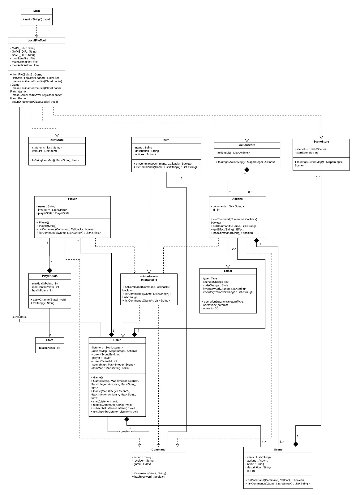

# Assignment 2

Maximum number of words for this document: 9000

Word Count: 430

**IMPORTANT**: In this assignment you will model the whole system. Within each of your models, you will have a *prescriptive intent* when representing the elements related to the feature you are implementing in this assignment, whereas the rest of the elements are used with a *descriptive intent*. In all your diagrams it is strongly suggested to used different colors for the prescriptive and descriptive parts of your models (this helps you in better reasoning on the level of detail needed in each part of the models and the instructors in knowing how to assess your models).

**Format**: establish formatting conventions when describing your models in this document. For example, you style the name of each class in bold, whereas the attributes, operations, and associations as underlined text, objects are in italic, etc.

### Implemented features

<table>
<tr>
<th>ID</th>
<th>Short Name</th>
<th>Description</th>
</tr>
<tr>
<td>F1</td>
<td>Commands</td>
<td>Game shall have a <b>text-based option system</b>, where the player can type different commands in a command prompt which will result in different
actions(F3).</td>
</tr>
<tr>
<td>F2</td>
<td>Interface</td>
<td>The game shall be played inside a <b>command prompt</b>. Everything is text. Some scenarios should have ASCII art.</td>
</tr>
<tr>
<td>F3</td>
<td>Actions</td>
<td>Typing <b>different commands shall result in different actions</b> in the game sceneStore, examples of such are:
    <ul>
    <li>Movement</li>
    <li>Attacking</li>
    <li>Conversation</li>
    <li>Interacting with items (doors, keys, picking up items)</li>
    <li>Dying (restarts the game)</li>
    <li>Healing</li>
    <li>Examining items and surrounding</li>
    <li>Sleeping</li>
    </ul>
</td>
</tr>
</table>

### Used modeling tool
Class Diagram: LucidChart

## Class diagram
Author(s): Sofia Konovalova

Associations described so far:
* Bidirectional association.
* Realization

The **Main** class is self-explanatory - it is the main function of the entire program. The main method of this class creates a *game* object which uses
the **LocalFileTool** class to load the game from a json file. The json file includes all of the necessary information about the game: the scenes of the game
(a.k.a. the game states), and information about the scenes: the possible actions, characters, and items. \
**LocalFileTool** has the attributes *MAIN_DIR*, *GAME_DIR*, *SAVE_DIR*, *mainItemFile*, *mainSceneFile*, and *mainActionsFile*. The first three attributes are
static variables describing the user's main directory, the directory of where the game file is saved, and the directory of the save file of the game.
Th function *fromFile(String)* takes in the name of the main game file as a string, and conerts that into information the game can use. The function
*makeNewGameFromFile(ClassLoader)* makes a new game from the resource files that are included with the game. *makeNewGameFromFile(ClassLoader, File)* creates a new
game from a json file that may be provided by the user. *listSaveFiles()* lists the save files that are available to the user to play from. \
The **LocalFileTool** class and the **Game** class have a bidirectional association, as the **Game** class looks to **LocalFileTool** to define its attributes,
while **LocalFileTool** creates the game object, hence the *<<create>>* attribute in the line describing the relationship.

The **Command** class can be thought of as a sort of "parser" for the commands that the player writes in the terminal when they are playing the game.
The **Command** class has the following attributes: *action* and *receiver*, which are both of type *String*, and *game*, which is a *Game* object. The atrribute
*action* states the action that the user has written, e.g. "inspect", the *receiver attribute describes the receiver of a particular action, e.g. "inspect phone"
has the action "inspect" and the receiver "phone". The *game* attribute is the current game state. \
The class has a constructor, *Command(Game, String)* which takes the command that the user has typed into the console, and splits it into the three attributes
listed above. The appropriate getters and setters for each of the attributes are used. \
Above, we have written that the class can be thought of as a "parser" of sorts for the commands. The class that actually handles these commands
is the interface **Interactable**. The classes **Player**, **Items** and **Actions** are all realizations of **Interactable**, as they use in some way
the functions within the interface to handle to different commands that apply to the player, items in the game, and actions that a player can take in a scene.

Maximum number of words for this section: 2500

Word Count: 430

## Object diagrams
Author(s): Koen van den Burg

This chapter contains the description of a "snapshot" of the status of your system during its execution.
This chapter is composed of a UML object diagram of your system, together with a textual description of its key elements.

`Figure representing the UML object diagram`

`Textual description`

Maximum number of words for this section: 500

## State machine diagrams
Author(s): Claudia Grigoras

This chapter contains the specification of at least 2 UML state machines of your system, together with a textual description of all their elements. Also, remember that classes the describe only data structures (e.g., Coordinate, Position) do not need to have an associated state machine since they can be seen as simple "data containers" without behaviour (they have only stateless objects).

For each state machine you have to provide:
- the name of the class for which you are representing the internal behavior;
- a figure representing the part of state machine;
- a textual description of all its states, transitions, activities, etc. in a narrative manner (you do not need to structure your description into tables in this case). We expect 3-4 lines of text for describing trivial or very simple state machines (e.g., those with one to three states), whereas you will provide longer descriptions (e.g., ~500 words) when describing more complex state machines.

The goal of your state machine diagrams is both descriptive and prescriptive, so put the needed level of detail here, finding the right trade-off between understandability of the models and their precision.

Maximum number of words for this section: 2500

## Sequence diagrams
Author(s): Bogdan Cercel

This chapter contains the specification of at least 2 UML sequence diagrams of your system, together with a textual description of all its elements. Here you have to focus on specific situations you want to describe. For example, you can describe the interaction of player when performing a key part of the videogame, during a typical execution scenario, in a special case that may happen (e.g., an error situation), when finalizing a fantasy soccer game, etc.

For each sequence diagram you have to provide:
- a title representing the specific situation you want to describe;
- a figure representing the sequence diagram;
- a textual description of all its elements in a narrative manner (you do not need to structure your description into tables in this case). We expect a detailed description of all the interaction partners, their exchanged messages, and the fragments of interaction where they are involved. For each sequence diagram we expect a description of about 300-500 words.

The goal of your sequence diagrams is both descriptive and prescriptive, so put the needed level of detail here, finding the right trade-off between understandability of the models and their precision.

Maximum number of words for this section: 2500

## Implementation
Author(s): Wilkin van Roosmalen

In this chapter you will describe the following aspects of your project:
- the strategy that you followed when moving from the UML models to the implementation code;
- the key solutions that you applied when implementing your system (for example, how you implemented the syntax highlighting feature of your code snippet manager, how you manage fantasy soccer matches, etc.);
- the location of the main Java class needed for executing your system in your source code;
- the location of the Jar file for directly executing your system;
- the 30-seconds video showing the execution of your system (you can embed the video directly in your md file on GitHub).

IMPORTANT: remember that your implementation must be consistent with your UML models. Also, your implementation must run without the need from any other external software or tool. Failing to meet this requirement means 0 points for the implementation part of your project.

Maximum number of words for this section: 1000

## References

References, if needed.
