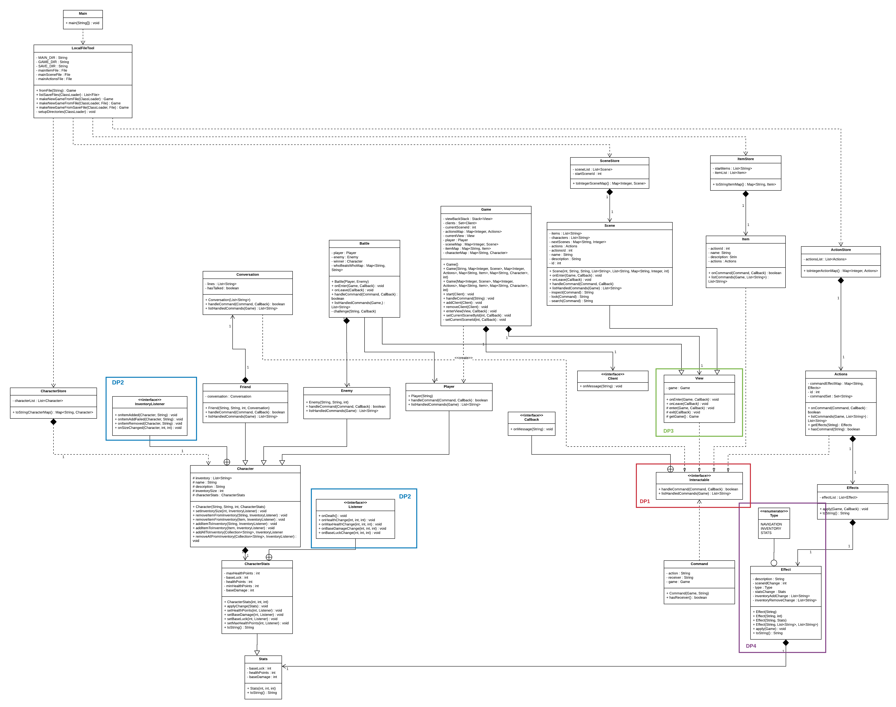
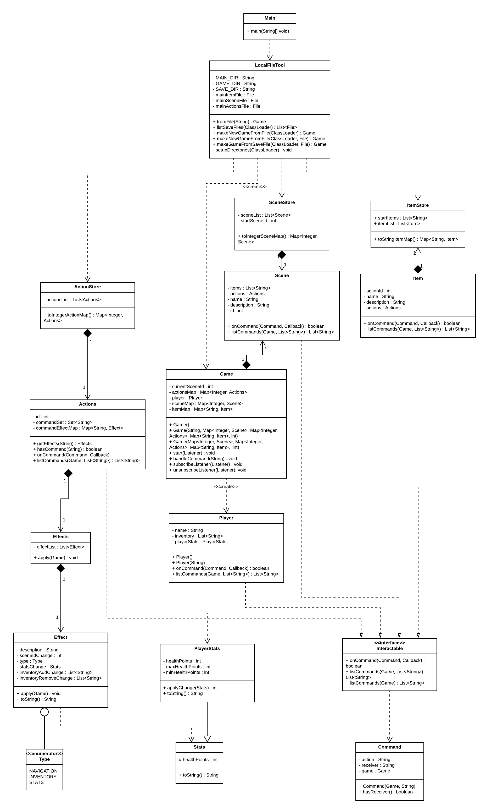
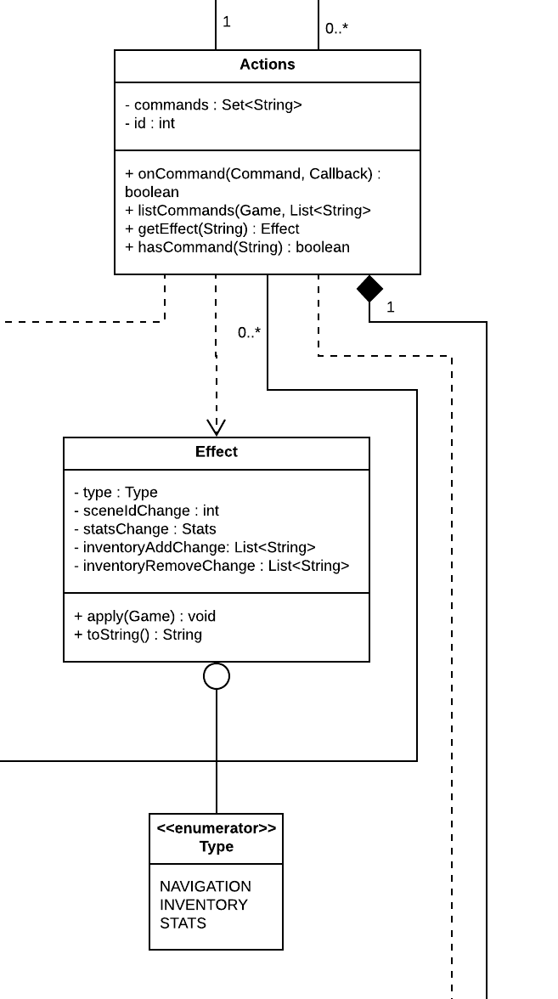
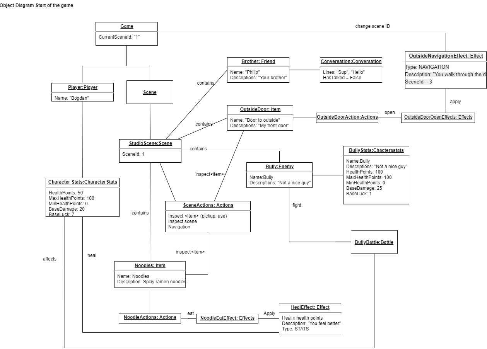
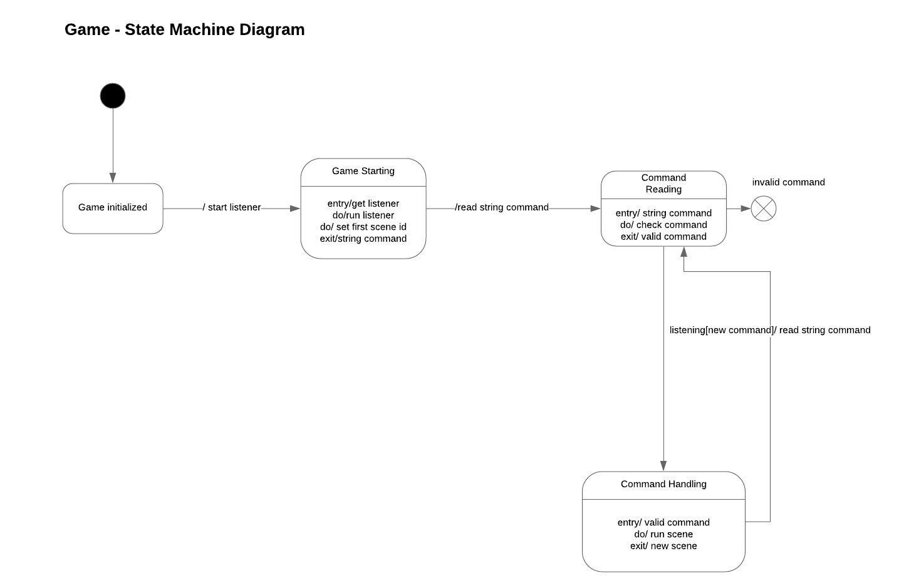
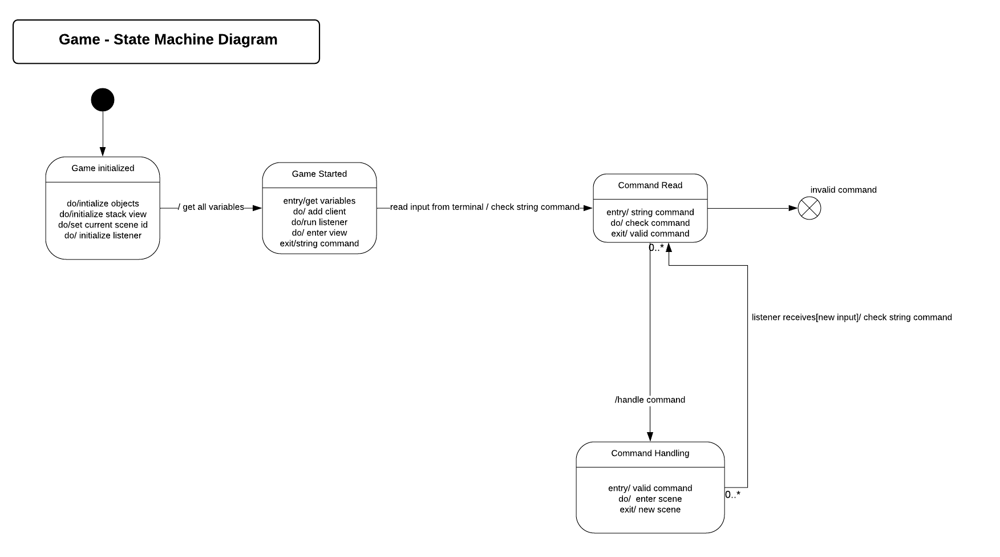
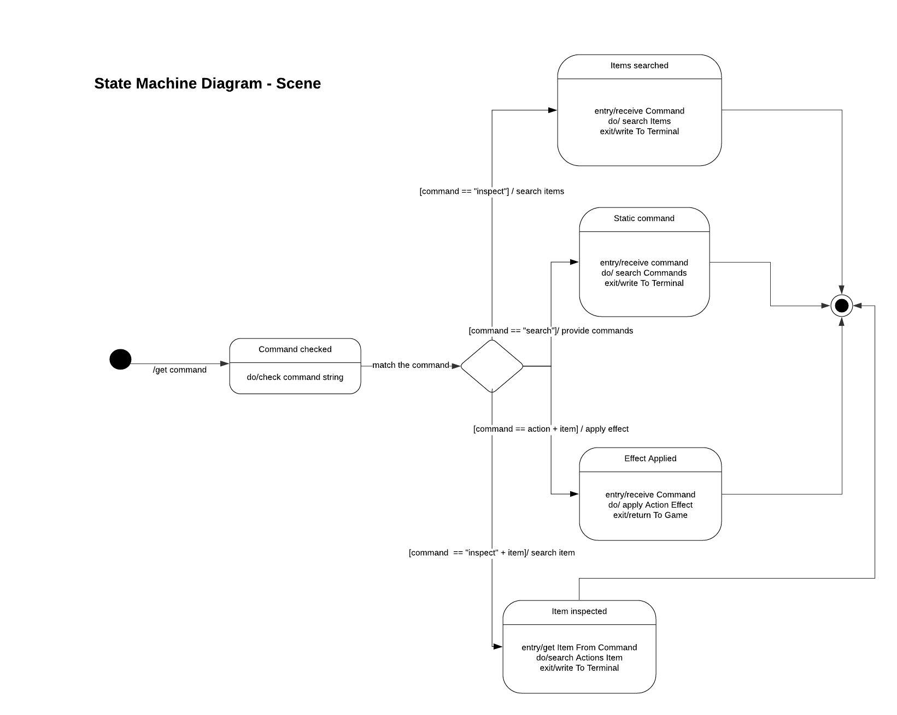
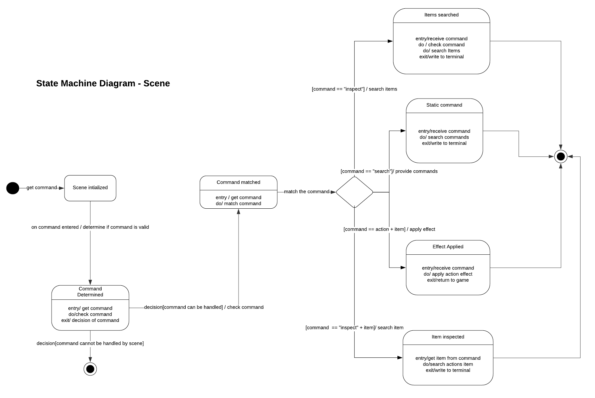

# Assignment 3

Max number of words for this document: 18000

Word Count: 4957

**IMPORTANT**: In this assignment you will fully model and impement your system. The idea is that you improve your UML models and Java implementation by (i) applying (a subset of) the studied design patterns and (ii) adding any relevant implementation-specific details (e.g., classes with “technical purposes” which are not part of the domain of the system). The goal here is to improve the system in terms of maintainability, readability, evolvability, etc.

**Format**: establish formatting conventions when describing your models in this document. For example, you style the name of each class in bold, whereas the attributes, operations, and associations as underlined text, objects are in italic, etc.

### Summary of changes of Assignment 2
Author(s): Everyone

Provide a bullet list summarizing all the changes you performed in Assignment 2 for addressing our feedback.

**UML Class Diagram:** \
From the feedback given by the TA, the following has been changed in the class diagram:
- Compositions were fixed -- if there was a composition and the encapsulated class was shared, this was fixed and removed.
This was mostly due to a misunderstanding of class diagrams and compositions in the beginning of the project, but now progress
in both of those areas was made.
- Missing features have been added: F6, F7, and F8 were added. The time mechanic feature (F9) was scrapped.
- Naming conventions were kept, because the convention made the code easier to read in some cases; for example,
the class is the plural **Actions** with multiplicity 1 as should be in a convention, but in the **ActionStore** class, the
attribute *actionsList* is easier to understand what it is, as it is a list of Actions that are possible: List&lt;Actions>

**UML State Machine Diagram:** 

From the feedback given by the TA, the biggest flaw that the state machine diagrams had, because of the naming of the states and other variables, these did not represent a state machine diagram anymore but an activity diagram. Upon reading, it became obvious that this is true and that this is a very common mistake within UML as the diagrams are fairly similar. Thus, the new diagrams tried to follow the state machine diagrams rules whereas the states should be represented by nouns. 

Maximum number of words for this section: 1000
Word Count: 240

### Application of design patterns
Author(s): Sofia Konovalova, Wilkin van Roosmalen

<table>
    <tr>
        <td><b>ID</b></td>
        <td><b>DP1</b></td>
        <td><b>DP2</b></td>
        <td><b>DP3</b></td>
        <td><b>DP4</b></td>
    </tr>
    <tr>
        <td><b>Design Pattern</b></td>
        <td>Command/Chain of Responsibility</td>
        <td>Observer</td>
        <td>Template</td>
        <td>Decorator</td>
    </tr>
    <tr>
        <td><b>Problem</b></td>
        <td>One of the problems that was found early in the planning of the game was how to implement the commands typed by the user during gameplay.
        The game has multiple things that can be interacted with, such as items and other characters. Actions and scenes could be thought of as interactive
        too, as you need to interact with a scene to achieve things in the game. We wanted to move the implementation of the command handling as far away
        from the separate "interactive" classes as possible, while keeping all of the command handling that would possibly be needed all in the same place,
        to be used by any class that could be "interacted" with by the user.</td>
        <td></td>
        <td>One of the problems that we had during the planning of the implementation of the game is that we had multiple classes that needed to implement
        very similar methods to each other, but the classes being inherently different in what they represented and how the functioned. For example, there are
        different environments a player can be in during the game: a scene where he is just exploring and interacting with items, or a combat situation
        where the player has to directly interact with another character. Both of these environments are different, but similar in a way.</td>
        <td>In the game, all actions have consequences in the form of changing scene, stats changing or the inventory changing. The problem was
        finding a way to be able to change the type of effect for every single action, without doing an operation that could be wasting time
        such as mapping actions to a certain type and then looking for the action that was just entered by the user -- this would take too much time
        and too much computational power. </td>
    </tr>
    <tr>
        <td><b>Solution</b></td>
        <td>The Chain of Responsibility pattern allows for data that can't be used by certain objects to be sent to a number of any other
        object that can use it. In the command pattern, an object encapsulates and represents all information needed to call a method
        at a later time. The Command design pattern is used to represent and encapsulate all the information needed to call a method at a later time.
        Our **Interactable** interface implements both of these design patterns. The **Interactable** interface also has an inner **Callback** class and a
        dependency to the **Command** class, so the command handling is moved even further away from the client. Since the **Interactable** interface is implemented
        by all of the game objects that need their own, dedicated commands, this is all encapsulated within one object of the class **Command** to be used at a later time.
        Since not all objects need to be command handling at every single point of the game, all the necessary command handling can be sent to
        any number of objects in the game that need it.</td>
        <td></td>
        <td>The Template Method design pattern is used when a group of subclasses need to implement a group of similar methods. This is done with an abstract class, and
        a method that contains a series of method calls that each subclass will call. In our case, this was done using the abstract class **View**. The classes
        **Scene** and **Battle** both inherit from this abstract class, as this class enables the player to exit and leave these different environments of the game. Previously,
        when there were no different environments, the **Scene** class implemented the **Interactable** interface directly, but with more environments added, there
        needed to be a "middle man", not only to have these multiple classes call similar methods but also to keep track of which environment the game is in, and how to
        get back to the environment it was previously in.</td>
        <td>The solution to this problem was the Decorator design pattern. This design pattern allows for objects to be modified at run time, a.k.a. having the
        capabilities of inheritance at run-time. This was done in the implementation using an enumerator for the types of effects that can occur: a
        navigation effect, a stats effect, and an inventory effect.</td>
    </tr>
    <tr>
        <td><b>Intended use</b></td>
        <td><b>I am bad with words</b></td>
        <td></td>
        <td>At run-time, the player would, for example, engage in combat with another character in the game. Once this happens, the method that controls entering the new "view" or environment is called and the combat scene begins, with the previous,
        non-combat scene being stored for later. Once the player exits combat, the method to exit the environment is called from the abstract class, and then the previous environment is replaced, so the player
        is back to where they were in the game before engaging in combat. </td>
        <td>At run-time, when a player enters an action command, a method is called that returns a list of objects of class **Effect**. These objects have
        their own descriptions and a type. Then, the type is the only thing that is important, and the appropriate changes are made depending on the
        type of effect from the enum variables, and the appropriate output is made to the player on the CLI if it is appropriate.</td>
    </tr>
    <tr>
        <td><b>Constraints</b></td>
        <td>N/A</td>
        <td></td>
        <td>N/A</td>
        <td>N/A</td>
    </tr>
    <tr>
        <td><b>Additional remarks</b></td>
        <td>N/A</td>
        <td>N/A</td>
        <td>N/A</td>
        <td>N/A</td>
    </tr>
</table>

Maximum number of words for this section: 2000
Word Count: 840

## Class diagram
Author(s): Sofia Konovalova

The class **Main** is the class that starts up the program and contains the main method of the program.
The main method of the class creates a *game* object which uses the **LocalFileTool** class
to load all the game information from json files. The way that the game is created depends on if there exists a save file
for the game already, or if there needs to be a new game created. This choice is picked by the user itself.
The json files contain all the necessary information about the game: the scenes of the game,
with the actions, characters and and items of each scene. The main method also contains an endless while loop, which constantly takes input
from the user until they write a command to quit the game.

**LocalFileTool** is the class where all of the file handling happens. It has the attributes *MAIN_DIR*, *SAVE_DIR*, and *GAME_DIR*, which are static variables
holding the directories of the respective files. The function *fromFile(String)* takes in the name of the main game file as a string, and converts
that into information the game can use. The function *makeNewGameFromFile(ClassLoader)* makes a new game from the resource files that are included with the
game. *makeNewGameFromFile(ClassLoader, File)* creates a new game from the json files that may be provided by the user. *makeNewGameFromSaveFile(ClassLoader, File)*
creates a new game from a save file that is locally stored. The three functions mentioned above return a *game* object. *listSaveFiles()* lists the save files
that are available to the user to play from. \
The **LocalFileTool** class and the **Game** class have a dependency association which is named "create", since the LocalFileTool creates the game from the
json files. The **Game** class uses the information from **LocalFileTool** to define it's attributes.

The abstract class **View** handles the "view" of the game -- meaning, handling the player entering game scenes and battles.
It has a *game* object of the class **Game**, and it has the methods *onEnter(Game, Callback)*, which handles the player entering the game scene/battle,
and the method *onLeave(Callback)*, which handles the player leaving a scene/battle. These methods output messages to the CLI, and handle
any further commands from there. This class is necessary, as there can be different "views" of the game by the player -- exploring a scene, being in a battle
or a conversation with a friendly character is a different view of the environment.

The **Game** class is the most important class of the game. It has the following attributes: *viewBackStack*, which is a stack which keeps track of the different
**View** class objects we are in; *client* which is a Set of objects of class **Client**; *currentView*, which is the environment view we are currently in;
*actionsMap*, which is a Map that associates an ID with an action; *characterMap*, which is a Map that associates a name with a object of class
**Character**; *currentSceneById*, which the unique ID of the current scene of the game we are in, a.k.a. the game
state; *sceneMap* which is a Map that associates the unique scene IDs with a *Scene* object; *itemMap*, which is a Map that associates a String name of an item
with the *Item* object; and finally, *player*, which is an object of class **Player**, which is the player in the game. \
There is usage of constructor overloading in this class, depending on what is available for the game to be made. The default constructor, *Game()*,
initialized the *viewBackStack* so the game can keep track of the environment views we are in. The constructors *Game(String, Map&lt;Integer, Scene>,
Map&lt;Integer, Actions>, Map&lt;String, Item>, Map&lt;String, Character>, int)* and *Game(Map&lt;Integer, Scene>, Map&lt;Integer, Actions>, Map&lt;String, Item>, Map&lt;String, Character>, int)* create a game from
the available information from the mapped actions, scenes and items, but they only differ in if the player name is available; otherwise the default name that is
hardcoded is used. The method *start(Client)* creates a "client" for the game, a.k.a. the player of the game; *addClient(Client)* adds a new client to the game -- even though
this method is not applicable at the current game version, it can be used to add a multiplayer function to the game. *removeClient(Client)* removes a client
from the client Set. *enterView(View, Callback)* is a method that enters a specific view of the game -- as explained before, a battle with an enemy or a
conversation with a friendly. *setCurrentSceneById(int, Callback)* has a public and private version, and make use of overloading. The difference between the
two is that the private method sets the game state to another scene, using the ID of the next scene that the game needs to move to. The method *handleCommand(String)* handles the commands
that the player inputs that are game-specific. It makes use of the Interactable interface's Callback interface to handle the commands.

The **Client** interface has only one method, which is *onMessage(String)*, which handles messages for clients.

There are also four "store" classes: **ActionStore**, **ItemStore**, **SceneStore** and **CharacterStore**.  These three classes store the actions in the game, the items in the game
and the scenes in the game respectively. The **SceneStore** class stores the list of *Scene* objects *scenesList*, and the ID of the starting scene, *startSceneId*. The function *toIntegerSceneMap()*
creates a hash map between the unique ID and the *Scene* object itself. The **ActionStore** acts similarly to the **SceneStore** class, containing only the *actionsList* attribute which is a List of *Actions* objects, and the function
*toIntegerActionMap()*, which creates a hash map between a unique ID of the scene and the actions that are available in that scene. The **ItemStore** class acts as the same companion as **ActionStore** does to **Action** and **SceneStore** to **Scene**, containing a List of *Item* objects, and
a function *toStringItemMap()* which creates a hash map of the name of the objects to the *Item* object. The **CharacterStore** class has an attribute *characterList*, which is a list of objects of class
**Character** in the game, and a method *toStringCharacterMap()* where each of the characters are mapped to their name.

The **Item** class describes the items that are available in the scenes. It has the attributes *name*, *description*, and *actions*, which is an *Actions* object
which determines which actions are available with this particular item. It has the functions *handleCommand(Command, Callback)* and *listCommands(Game, List&lt;String>)* which
use the **Interactable** interface as items are interactable within the game and need to be handled appropriately. \

The **Character** abstract class defines everything in common between the different characters in the game. There are three kinds of Characters: the player, enemies
and friendlies. Therefore, the **Player**, **Enemy** and **Friend** class are subclasses of **Character**. The class has the following attributes: *inventory*, which is a list
of all the items that the character has in their inventory; *name*, which the name of the character; *description*, which a description of the character;
*inventorySize*, which an integer describing how many objects can be held in the inventory of the character; and *characterStats*, which is an object of the class
**CharacterStats**, which describes stats of the characters such as health points. The constructor *Character(String, String, int)* creates the character
with the name of the character, their description and their inventory size as parameters. The methods *setInventorySize(int, InventoryListener)*,
*addItemToInventory(String, InventoryListener)*, *addAllToInventory(Collection&lt;String>, InventoryListener)*, *removeAllFromInventory(Collection&lt;String>,
InventoryListener)* are all methods that deal with the character's inventory. The method names speak for themselves, but a Collection data type is used when
we need to remove multiple items from the Character's inventory. The methods make use of the class' inner InventoryListener interface, which has methods
*onItemAdded(Character, String)*, *onItemAddFailed(Character, String)*, *onItemRemoved(Character, String)* and *onSizeChanged(Character, int, int)* which
deal with the handling of items being inserted and taken out of the inventories of certain characters.

The **CharacterStats** class describes the stats a particular character has. The class has the following attributes: *maxHealthPoints* and *minHealthPoints*,
which describes the maximum and minimum amount of health points a character can have, respectively; *baseLuck*, *baseDamage* and *healthPoints* have the
same function as in the **Stats** class, described below. The constructor *CharacterStats(int, int, int)* initializes the stats of the character.
*setHealthPoints(int, Listener)*, *setBaseDamage(int, Listener)*, *setBaseLuck(int, Listener)* and *setMaxHealthPoints(int, Listener)* are all setters of the attributes
described above, that use an inner class **Listener** to handle any consequences that might come from the different stats changing
throughout the game. The inner class **Listener** has methods *onDeath()*, which handles the consequences if a character dies; *onMaxHealthChange(int, int, int)*,
*onMaxHealthChange(int, int, int)*, *onBaseDamageChange(int, int, int)* and *onBaseLuckChange(int, int, int)* are all handlers of the different changes that could be
made to the attributes in the class **CharacterStats**. The **CharacterStats** class also has the method *applyChange(Stats)*, which applies any changes
that have been made to the character's stats to the appropriate object of the class **Stats**.

The **Stats** class is a sort of template for all of the stats that are possible in the game. It has the following attributes: *baseLuck*, which describes the luck of the
character when attacking, for example; *healthPoints*, which is the amount of health points any character can have; *baseDamage*, which the amount of damage
a character can give. The constructor *Stats(int, int, int)* uses the three attributes to create the stats of the character.

The **Player**, **Enemy** and **Friend** class are very similar to each other, with some differences. All three of them have constructors: *Player(String)*, which creates
a player with a certain name; *Enemy(String, String, int)* which creates an enemy with a name, description and inventory size; *Friend(String, String, int, Conversation)*
which works the same name as the **Enemy** constructor. All three of them use the methods *handleCommand(Command, Callback)* and *listCommands(Game, List<String>)* from the
**Interactable** interface, for the game to handle commands that are specific to those three characters. The **Friend** class has an attribute *conversation* which is an object
of the class **Conversation** -- this is to enable conversation between the player and friendlies, as you cannot engage in battle with them, but you can maybe
extract some information from them during the game.

The **Conversation** class has two attributes: *lines*, which is a list of lines that the friendly character says, and *hasTalked*, which is a boolean indicating
if there have been previous interactions with the friendly character before, which would make them say a different line. The constructor *Conversation(List<String> lines)*
initializes the attributes, and hence the conversation. The class implements the **Interactable** interface, which means it has command handling with the
operations *handleCommand(Command, Callback)* and *listCommands(Game, List&lt;String>)*.

The **Scene** class defines the actions that are possible at a given time, the items that are in each scene, and the description of the scene itself.
It handles commands that are scene-specific, such as "search" or "inspect". The class has the attributes *items*, which is a list of items available in the scene,
*actions*, which is an *Actions* object which specifies the actions that can be taken in the scene, the *name* string, *description* string, and the unique *id*
integer of the scene. It has the same *handleCommand(Command, Callback)* and *listCommands(Game, List<String>)* that is also present in the **Actions** class. This is because
actions, scenes and items are all interactable, and therefore need these functions to decide what to do when a certain command is typed in. \
The **SceneStore** class stores the list of *Scene* objects *scenesList*, and the ID of the starting scene, *startSceneId*. The function *toIntegerSceneMap()*
creates a hash map between the unique ID and the *Scene* object itself. The class also has the methods *onEnter(Game, Callback)* and *onLeave(Callback)*, which are
methods extended from the **View** class.

The class **Battle** extends the class **View**. This is the class that handles the battles between the player and the enemy characters in the game.
It has the attributes *player*, which is an object of class **Player**, *enemy*, which is an object of class **Enemy**, *winner*, which is an object of class
**Character**, and *whoBeatsWhoMap*, which is maps a name of an attack to an attack that it beats. The constructor *Battle(Player, Enemy)* sets the player and the
enemy for the battle that is about the happen. The methods *onEnter(Game, Callback)* amd *onLeave(Callback)* are inherited from the **View** class, which is
explained further below. It also implements methods from the **Interactable** interface -- *handleCommand(Command, Callback)* and *listCommands(Game, List<String)*. The last
method is the *challenge(String, Callback)*, which handles the actual battle happening, a.k.a. one character challenging another one,
and then informing the player on the CLI of the result.

The **Actions** class has the attributes *commands*, which is a Set of strings of actions commands, and *id*, which is a unique id of the scene that comes
after an action command is written to the console. Since the **Actions** is a realization of the interface **Interactable**, it has the functions *handleCommand(Command, Callback)*
and *listHandledCommands(Game)* which handle the commands to decide what the game should do next should the player enter an action command, and which
prints out the list of possible action commands in a scene respectively. It also has a function *getEffect(String)* which returns an object of the class *Effect*,
which is precisely what determines the effect of an action on a player. For example, one action could increase health points and another one decrease them. The
*hasCommand(String)* function checks if the command that the player has type actually exists, and returns a boolean. \
The **Effect** class handles the effects of each of the action. One of the most important aspects of the class is that is has an enumerator named *Type*, which determines
the type of effect that an action has -- the attributes of the enumerator are *NAVIGATION*, *INVENTORY*, *STATS*, which determine that an action can have an effect on the
navigation through the world (the player moving from one place to another), on the inventory (picking up an object), or on the stats of the player (sleeping increasing health
points, smoking cigarettes decreasing them). The class has the following attributes: *description*, which is the description of the scene, printed out to the player
once they enter the scene; *sceneIdChange* which determines to which scene the player changes to, as actions can have navigation effects, meaning a change
of scene; *type*, which is the enumerator described above; *statsChange*, which returns an object of the class **Stats** which describes any changes that have
been made to the player's stats based on their actions; *inventoryAddChange* and *inventoryRemoveChange* which returns a list of the inventory after a new item
is being added or removed as a result of the player's action. The class makes use of constructor overloading, with the following constructors:
*Effect(String), which is initializes the description of the effect; *Effect(String, int)* which initializes the description with the ID of the scene that
we are changing to; *Effect(String, Stats)* which initializes the description the effect to the stats of a character; and *Effect(String, List<String>, List<String>)* which
initializes the description of the effect along with the changes to the inventory.\
Now, if we focus on this part of the previous version of the class diagram: \

What happened before is when a command is entered, the *Actions* object handles it in the *handleCommand(Command, Callback)* method.
Then, the *Effect* object is retrieved and applied. What exactly happens when an *Effect* is applied depends on the *Effect.type*. We decided to improve this
by having one command to apply multiple effect types. This is implemented using the **Effects** class. \
The **Effects** class has two attributes: *effectList*, which is a list of *Effect* objects, and the method *apply(Game)*, to apply the effects to the game.
Now, the **Effects** class contains a collection of effects, and the *apply(Game)* method applies all the effects at once. Instead of mapping a command to an
*Effect* object, it is now mapped to an *Effects* object, which handles the application of the effects to the game. The **Effects** and **Actions** class have a
composition relationship, because an action has an effect, but the effect cannot exist without the action existing as well.

The **Command** class can be thought of as a sort of "parser" for the commands that the player writes in the terminal when they are playing the game.
The **Command** class has the following attributes: *action* and *receiver*, which are both of type *String*, and *game*, which is a *Game* object. The atrribute
*action* states the action that the user has written, e.g. "inspect", the *receiver attribute describes the receiver of a particular action, e.g. "inspect phone"
has the action "inspect" and the receiver "phone". The *game* attribute is the current game state. \
The class has a constructor, *Command(Game, String)* which takes the command that the user has typed into the console, and splits it into the three attributes
listed above. The appropriate getters and setters for each of the attributes are used. \
Above, we have written that the class can be thought of as a "parser" of sorts for the commands. The class that actually handles these commands
is the interface **Interactable**. The classes **Player**, **Items** and **Actions** are all realizations of **Interactable**, as they use in some way
the functions within the interface to handle to different commands that apply to the player, items in the game, and actions that a player can take in a scene. \
The **Interactable** interface defines two methods, which deal with command handling within the game. It has an interface named **Callback** which deals
with outgoing messages in the CLI during gameplay. The *listHandledCommands(Game)* lists the possible commands that can be written by the player at a particular
game state. The *handleCommand(Command, Callback)* actually handles the command.

Word Count: 2914

## Object diagrams
Author(s): Koen van den Burg

This Object diagram captures the snapshot of the very beginning of the game.
Everything shown in the object diagram is implemented into our system.
The master object is the **Game** object which holds the *CurrentSceneId* which is 1.
The **game** object is connected to the **Player** object and the **Scene** object.
The **Player** object has one attribute, the *name* which is “Bogdan” and is connected with the **CharacterStats** objects which holds the current *HealthPoints* (at this time 50), the *MaxHealthPoints*(100), the *MinHealthPoints*(0), the *BaseDamage*(20) and the *BaseLuck* (7).

The second object connected to the game object is the **Scene** object which is connected to the first scene of the game, the “Studio scene”. The **Scene** object is connected with the **SceneActions** object that holds the commands which can be carried out by the player. The available actions are: *Inspect<**item**>*(for interacting with items in the scene), *Inspect scene*(for giving the player more information about the current scene he is in) and the *Navigation* action for moving around in the scene.

The **StudioScene** contains the following objects: The **Brother** of type **Friend**, The **Bully** of type **Enemy**, **OutsideDoor** and **Noodles** both of type **Item**.
The bully has its own **CharacterStats**, same as the player has, only with different values.

The **Bully** object is connected to an object called **BullyBattle** of type **Battle**, which, when a fight command is used, initiates a battle between the bully and the player, which has effect on the players’ **CharacterStats**, mainly the *HealthPoints*.

The **Brother** object is connected to an object **Conversation** with a few dialog options, stored in the *Lines* attribute* along with a Boolean *hasTalked* which is False at the start of the game.

The **door** item named “**OutsideDoor**” will lead to a chain of objects being used in order to progress into another scene. For this particular door, what happen is when the **OutsideDoorEffect** “open” is used on the item **OutsideDoor** the **OutsideDoorOpenEffect** object is created which leads to the object **OutsideNavigationEffect** of type **Effect**, this object has a *type* attribute which holds *NAVIGATION*, this will set the **Game** objects’ current **SceneId** to “3”.
The item **Noodles** is connected to an Action object called **NoodleActions**. With the command “eat” it will instantiate an object **NoodleEatEffect** of **Effects** type, which then will lead to an object **HealEffect** of type **Effect** with *Type* attribute *STATS*. This object is connected to the players’ **CharacterStats** object and will add HealthPoints to the players’ statistics.

Word count: 406

## State machine diagrams
Author(s): Claudia Grigoras

<b> Game Class - State Machine Diagram </b>

The state machine diagrams, same as the whole design and the implementation has been through quite some changes. First of all, within a previous version, a very common design mistake has been made whereas the state machine diagrams became activity diagrams, due to the naming of states and of the events. This has been updated upon feedback and the diagram has become as follows (for the previous version).

Within this diagram, it can be seen that the **game** class has four finite states which are “Game initialized”, “Game starting”, “Command reading” and “Command handling”. The initialization process within this state machine is represented by a simple state, and the other states are triggered through activities and events. The “Game initialized” is triggered by “start listener”, the “Command reading” is triggered by “read command string”, in both cases as, and the “Command Handling” has to trigger within this diagram.

Not only the naming had to be further adjusted, but the initialization and the triggers changed as the whole design changed. This led to a new state machine diagram for the class **game** as it can be found below.

As it can be seen, the names of the states have been more appropriately named here in order to point out that these are states, and the names are nouns. 

The “Game initialized” state, is no longer a simple state but it became a composite state, whereas the internal activities performed within this state are as follows: it initializes an instance of all needed classes, initializes the stack for the views, set the first and current scene id and initializes the listener. 

The next state is triggered by the activity to get all these variables. This state is called “Game started”. When entering this scene, all the variables are received. Then, as internal activities, this state adds a client to the environment, runs the listener and makes sure that a view can be entered. 

The next state is triggered by the event of reading input from the terminal, and then the activity of checking the string that has been read. Then the system enters the state “Command Read”. Here, the state receives the input, and then checks and verifies whether it is a valid input. 

The next state is triggered by the handle command activity. Here the command is read, and as an internal activity the state enters the scene corresponding to that command. Through here, the system will go through a number of states that belong to the **scene** class. Then, at exiting those states, the “Command Handling” exits with a new scene. The listener is still active throughout this class, and if it is triggered by new input, then the “Command Read” state will be reached again. Therefore the **game** class can reach these two states in a continuous loop. 

<b> Scene Class - State Machine Diagram </b>

Same as with the state machine diagram for the **game** class, the state machine diagram for the **scene** class needed quite some relevant changes in naming but also states and triggers wise. The design of the system and the implementation have changed for this class as well. The previous state machine (already corrected in naming for the last assignment) is as follows:

Within this diagram, it can be seen that most of the states for this class are triggered by matching a command string to a specific string. Then a new state is entered. 

That part has not changed for the new system. However, the initialization of this class and how the commands are being read have changed. The new state machine diagram is as follows:

 Thus, the first major change within the new state machine diagram is the fact that two new states have been added. The first state is “Scene initialized”, a state that is reached upon initializing all the variables. 

Then, the event of entering a command triggers a new state, which is “Command Determined”. Here the state checks the command whether it can be handled or not by this scene. If it is determined that it cannot, then the class reaches its final state. However, in the event that this scene can handle this command, then same as in the previous state machine diagram, a new state “Command matched” is entered. 

Within this state, the system is evaluating the command received. From the "Command checked" state there are four alternate paths for the states transitions. All of these depends on reading the string command and comparing it to different strings.

The first alternate transition is when the condition command == "inspect" is met, and nothing else follows this string. Then, the following state is the "Items searched" composite state. The event "search items" triggers this state, which in turn performs this search as an internal activitiy. At exit, it writes these items to the terminal, and then it reaches its final state.

The second alternate transition is when the command == "search" is being met. Here, the activity "provide commands" triggers this state, which in turn it searches these commands as part of its internal activity. At the exit of this state, the retrieved commands are written to the terminal and then the machine reaches the final state.

The third alternate transition is when the command == action + item. Both action and items correspond to objects actions and items, that have specific effects. This state is called "Effect applied". The activity that triggers this state, is to apply effect. It performs this as an internal activity, and then at exit it then returns to the game machine with a new scene id as the effect changes the scene id, and then reaches the final state of the scene.

The last alternate transition is when the command = "inspect" + item (item is a variable). When this string is being matched, then the diagram transitions to "Item inspected" state. Here, at entry, it only retrieves the item from the string. Then, it searches for all the actions that are valid for that item within this scene. If the item has been found along with all its possible actions, then these are written to the terminal and then it reaches its final state.

Word count: 1050
Maximum number of words for this section: 4000

## Sequence diagrams
Author(s): Bogdan Cercel

This chapter contains the specification of at least 2 UML sequence diagrams of your system, together with a textual description of all its elements. Here you have to focus on specific situations you want to describe. For example, you can describe the interaction of player when performing a key part of the videogame, during a typical execution scenario, in a special case that may happen (e.g., an error situation), when finalizing a fantasy soccer game, etc.

For each sequence diagram you have to provide:
- a title representing the specific situation you want to describe;
- a figure representing the sequence diagram;
- a textual description of all its elements in a narrative manner (you do not need to structure your description into tables in this case). We expect a detailed description of all the interaction partners, their exchanged messages, and the fragments of interaction where they are involved. For each sequence diagram we expect a description of about 300-500 words.

The goal of your sequence diagrams is both descriptive and prescriptive, so put the needed level of detail here, finding the right trade-off between understandability of the models and their precision.

Maximum number of words for this section: 4000

## Implementation
Author(s): Wilkin van Roosmalen

### Writing the Code

After discussing and creating the first UML models, we started on the implementation.
First, a skeleton was made.
All classes were created and populated with the attributes and methods defined in the Class diagram.
We quickly found a couple points of improvement, and went back to changing the diagrams.

After implementing the changes, we went on to writing the actual methods.
For Assignment 3, we cleaned up some of the code. Although there are always improvements to be made.
Luckily, most methods have the same structure:
Besides getters and setters, the `onCommand(Command, Callback)` methods play an important role.
These methods are implemented using a bunch of if-statements and for loops to check whether commands can be handled.

For Assignment 2, a major issue we had to solve was storing the game info. The `Game` object refers to a lot of objects.
Simply converting the `Game` object to JSON and back would not work.
To solve this problem, three "Store" objects were created: `ActionStore`, `ItemStore`, `CharacterStore`, and `SceneStore`.
These objects are populated using the GSON library in `LocalFileTool`.
Then, their contents are given to the `Game` object.
Implementing these "Store" objects allowed us to easily get a game going.

In the resources folder, three files can be found:

- main-game.actions.json (ActionStore)
- main-game.items.json (ItemStore)
- main-game.scenes.json (SceneStore)
- main-game.characters.json (CharacterStore)

These files contained the actual content of the game, but are now outdated and should either be replaced or removed.
By adding and changing the values in these files, the game can be extended.

For Assignment 3, the main game files are redundant. Instead, we chose to build an example Game in **GameFactory**.

We also automatically save the game, using the methods in **LocalFileTool**.
A lot of attributes throughout the code use the `transient` keyword, to avoid these attributes from being serialized by GSON when the Game is saved.

### Implementing Features

The three features that were important to implement as they were, as we believed, to be a crucial part of any text-
based game were:
- Commands
- Interface
- Actions

All three of these features were implemented using a **Interactable** interface.
Using an interface meant that the same "template" could be used for anything within the game that was interactable.
Actions are things we do with objects or to move around the environment, so therefore it was an interactable part of the game.
Commands are an interactable part of the game, so therefore they used the interface.
This interface did not exist in the first version of our class model, and with time we realized
that this made our system and code easier to work with.

The interface feature is a success.
Our program uses the command line interface of the user's computer.
The interface, in a way, even goes further by using the file system of the user in order to keep local save files so that the player can choose to extend the game if they want.
This allows for the interface of the game to be independent from the actual game itself.

### Libraries
This product uses the Google GSON library and the Apache Commons IO library. During the implementation of oour project, we realized that most of the libraries
we researched were either not relevant, like TextIO and TinyLogger (TextIO would bloat the game too much, as it all worked perfectly fine with the default console,
and TinyLogger being unnecessary during the second phase of class modeling), or it was not applicable to the features we wanted to implement but was still
possible to be used in the future, such as KryoNet. GSON and Commons IO proved to be a good match for our product as of now, making our game work simply and
smoothly.

### Building and Running
To execute this system, run the game.applicationBase.Main class.

The system can be build using `gradle jar`. The resulting .jar file can be found in `build/libs/`.

A pre-built .jar is located in the `out/` directory.

Run the program by calling `java -jar out/sofware-design-vu-2020-1.1.jar`. Make sure to at least use java 11.
You can always exit the program by entering `quit` or `ctrl+C` in the terminal.

**NOTE:** _Running the program will create a folder in your home directory: `.spork/`.
This folder can be deleted afterwards and does not hold any important information (yet)._

### Showcase

This video shows a quick demo of our current implementation:

Wordt count: 735 words
