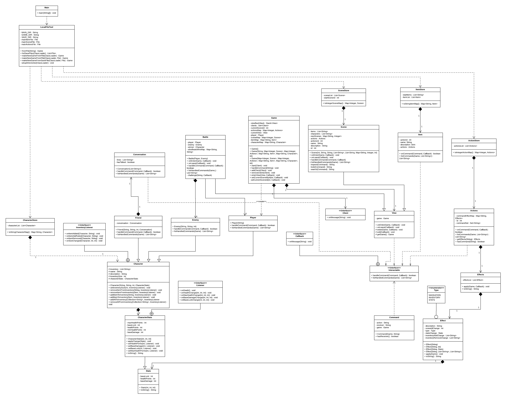

# Assignment 3

Maximum number of words for this document: 18000

Word Count: 1977

**IMPORTANT**: In this assignment you will fully model and impement your system. The idea is that you improve your UML models and Java implementation by (i) applying (a subset of) the studied design patterns and (ii) adding any relevant implementation-specific details (e.g., classes with “technical purposes” which are not part of the domain of the system). The goal here is to improve the system in terms of maintainability, readability, evolvability, etc.

**Format**: establish formatting conventions when describing your models in this document. For example, you style the name of each class in bold, whereas the attributes, operations, and associations as underlined text, objects are in italic, etc.

### Summary of changes of Assignment 2
Author(s): Bogdan Cercel

Provide a bullet list summarizing all the changes you performed in Assignment 2 for addressing our feedback.

Maximum number of words for this section: 1000

### Application of design patterns
Author(s): Sofia Konovalova, Wilkin van Roosmalen

For each application of any design pattern you have to provide a table conforming to the template below.

<table>
    <tr>
        <td><b>ID</b></td>
        <td><b>DP1</b></td>
        <td><b>DP2</b></td>
        <td><b>DP3</b></td>
        <td><b>DP4</b></td>
    </tr>
    <tr>
        <td><b>Design Pattern</b></td>
        <td>Command/Chain of Responsibility</td>
        <td>Observer</td>
        <td>Template</td>
        <td>Decorator</td>
    </tr>
    <tr>
        <td><b>Problem</b></td>
        <td></td>
        <td>A paragraph describing the problem you want to solve</td>
        <td>A paragraph describing the problem you want to solve</td>
    </tr>
    <tr>
        <td><b>Solution</b></td>
        <td></td>
        <td>A paragraph describing why with the application of the design pattern you solve the identified problem</td>
        <td>A paragraph describing why with the application of the design pattern you solve the identified problem</td>
    </tr>
    <tr>
        <td><b>Intended use</b></td>
        <td></td>
        <td>A paragraph describing how you instend to use at run-time the objects involved in the applied design patterns (you can refer to small sequence diagrams here if you want to detail how the involved parties interact at run-time)</td>
        <td>A paragraph describing how you instend to use at run-time the objects involved in the applied design patterns (you can refer to small sequence diagrams here if you want to detail how the involved parties interact at run-time)</td>
    </tr>
    <tr>
        <td><b>Constraints</b></td>
        <td>One of the constraints is that commands for each of the interactable features have to be quite similar to each other, with not a lot of room
        for difference or creativity. This is not a big problem, but if the game were to be more complicated this could be a difficulty.</td>
        <td>Any additional constraints that the application of the design pattern is imposing, if any </td>
        <td>Any additional constraints that the application of the design pattern is imposing, if any </td>
    </tr>
    <tr>
        <td><b>Additional remarks</b></td>
        <td>N/A</td>
        <td>Optional, only if needed</td>
        <td>Optional, only if needed</td>
    </tr>
</table>

Maximum number of words for this section: 2000
## Class diagram
Author(s): Sofia Konovalova

**not the final class diagram, but needed for me to write this up for now**

- [x] LocalFileTool
- [x] Main
- [x] ActionStore
- [x] ItemStore
- [x] SceneStore
- [ ] Actions
- [x] Battle
- [x] Character
- [ ] CharacterStats
- [x] Client
- [x] Command
- [ ] Conversation
- [x] Effect
- [x] Effects
- [x] Enemy
- [x] Friend
- [x] Game
- [x] Interactable
- [ ] Item
- [x] Player
- [x] Scene
- [ ] Stats
- [x] View

The class **Main** is the class that starts up the program and contains the main method of the program.
The main method of the class creates a *game* object which uses the **LocalFileTool** class
to load all the game information from json files. The way that the game is created depends on if there exists a save file
for the game already, or if there needs to be a new game created. This choice is picked by the user itself.
The json files contain all the necessary information about the game: the scenes of the game,
with the actions, characters and and items of each scene. The main method also contains an endless while loop, which constantly takes input
from the user until they write a command to quit the game.

**LocalFileTool** is the class where all of the file handling happens. It has the attributes *MAIN_DIR*, *SAVE_DIR*, and *GAME_DIR*, which are static variables
holding the directories of the respective files. The function *fromFile(String)* takes in the name of the main game file as a string, and converts
that into information the game can use. The function *makeNewGameFromFile(ClassLoader)* makes a new game from the resource files that are included with the
game. *makeNewGameFromFile(ClassLoader, File)* creates a new game from the json files that may be provided by the user. *makeNewGameFromSaveFile(ClassLoader, File)*
creates a new game from a save file that is locally stored. The three functions mentioned above return a *game* object. *listSaveFiles()* lists the save files
that are available to the user to play from. \
The **LocalFileTool** class and the **Game** class have a dependency association which is named "create", since the LocalFileTool creates the game from the
json files. The **Game** class uses the information from **LocalFileTool** to define it's attributes.

The abstract class **View** handles the "view" of the game -- meaning, handling the player entering game scenes and battles.
It has a *game* object of the class **Game**, and it has the methods *onEnter(Game, Callback)*, which handles the player entering the game scene/battle,
and the method *onLeave(Callback)*, which handles the player leaving a scene/battle. These methods output messages to the CLI, and handle
any further commands from there. This class is necessary, as there can be different "views" of the game by the player -- exploring a scene, being in a battle
or a conversation with a friendly character is a different view of the environment.

The **Game** class is the most important class of the game. It has the following attributes: *viewBackStack*, which is a stack which keeps track of the different
**View** class objects we are in; *client* which is a Set of objects of class **Client**; *currentView*, which is the environment view we are currently in;
*actionsMap*, which is a Map that associates an ID with an action; *currentSceneById*, which the unique ID of the current scene of the game we are in, a.k.a. the game
state; *sceneMap* which is a Map that associates the unique scene IDs with a *Scene* object; *itemMap*, which is a Map that associates a String name of an item
with the *Item* object; and finally, *player*, which is an object of class **Player**, which is the player in the game. \
There is usage of constructor overloading in this class, depending on what is available for the game to be made. The default constructor, *Game()*,
initialized the *viewBackStack* so the game can keep track of the environment views we are in. The constructors *Game(String, Map<Integer, Scene>,
Map<Integer, Actions>, Map<String, Item>, int)* and *Game(Map<Integer, Scene>, Map<Integer, Actions>, Map<String, Item>, int)* create a game from
the available information from the mapped actions, scenes and items, but they only differ in if the player name is available; otherwise the default name that is
hardcoded is used. The method *start(Client)* creates a "client" for the game, a.k.a. the player of the game; *addClient(Client)* adds a new client to the game -- even though
this method is not applicable at the current game version, it can be used to add a multiplayer function to the game. *removeClient(Client)* removes a client
from the client Set. *enterView(View, Callback)* is a method that enters a specific view of the game -- as explained before, a battle with an enemy or a
conversation with a friendly. *setCurrentSceneById(int, Callback)* has a public and private version, and make use of overloading. The difference between the
two is that the private method sets the game state to another scene, using the ID of the next scene that the game needs to move to. The method *handleCommand(String)* handles the commands
that the player inputs that are game-specific. It makes use of the Interactable interface's Callback interface to handle the commands.

There are also three "store" classes: **ActionStore**, **ItemStore**, **SceneStore**.  These three classes store the actions in the game, the items in the game
and the scenes in the game respectively. The **SceneStore** class stores the list of *Scene* objects *scenesList*, and the ID of the starting scene, *startSceneId*. The function *toIntegerSceneMap()*
creates a hash map between the unique ID and the *Scene* object itself. The **ActionStore** acts similarly to the **SceneStore** class, containing only the *actionsList* attribute which is a List of *Actions* objects, and the function
*toIntegerActionMap()*, which creates a hash map between a unique ID of the scene and the actions that are available in that scene. The **ItemStore** class acts as the same companion as **ActionStore** does to **Action** and **SceneStore** to **Scene**, containing a List of *Item* objects, and
a function *toStringItemMap()* which creates a hash map of the name of the objects to the *Item* object.

The **Client** interface...

The **Character** abstract class defines everything in common between the different characters in the game. There are three kinds of Characters: the player, enemies
and friendlies. Therefore, the **Player**, **Enemy** and **Friend** class are subclasses of **Character**. The class has the following attributes: *inventory*, which is a list
of all the items that the character has in their inventory; *name*, which the name of the character; *description*, which a description of the character;
*inventorySize*, which an integer describing how many objects can be held in the inventory of the character; and *characterStats*, which is an object of the class
**CharacterStats**, which describes stats of the characters such as health points.

The **Player** class...

The **Enemy** class...

The **Friend** class...

The **Scene** class defines the actions that are possible at a given time, the items that are in each scene, and the description of the scene itself.
It handles commands that are scene-specific, such as "search" or "inspect". The class has the attributes *items*, which is a list of items available in the scene,
*actions*, which is an *Actions* object which specifies the actions that can be taken in the scene, the *name* string, *description* string, and the unique *id*
integer of the scene. It has the same *onCommand(Command, Callback)* and *listCommands(Game, List<String>)* that is also present in the **Actions** class. This is because
actions, scenes and items are all interactable, and therefore need these functions to decide what to do when a certain command is typed in. \
The **SceneStore** class stores the list of *Scene* objects *scenesList*, and the ID of the starting scene, *startSceneId*. The function *toIntegerSceneMap()*
creates a hash map between the unique ID and the *Scene* object itself. The class also has the methods *onEnter(Game, Callback)* and *onLeave(Callback)*, which are
methods extended from the **View** class.

The class **Battle** extends the class **View**. This is the class that handles the battles between the player and the enemy characters in the game.
It has the attributes *player*, which is an object of class **Player**, *enemy*, which is an object of class **Enemy**, *winner*, which is an object of class
**Character**, and *whoBeatsWhoMap*, which is maps a name of an attack to an attack that it beats. The constructor *Battle(Player, Enemy)* sets the player and the
enemy for the battle that is about the happen. The methods *onEnter(Game, Callback)* amd *onLeave(Callback)* are inherited from the **View** class, which is
explained further below. It also implements methods from the **Interactable** interface -- *onCommand(Command, Callback)* and *listCommands(Game, List<String)*. The last
method is the *challenge(String, Callback)*, which handles the actual battle happening, a.k.a. one character challenging another one,
and then informing the player on the CLI of the result.

The **Effect** class handles the effects of each of the action. One of the most important aspects of the class is that is has an enumerator named *Type*, which determines
the type of effect that an action has -- the attributes of the enumerator are *NAVIGATION*, *INVENTORY*, *STATS*, which determine that an action can have an effect on the
navigation through the world (the player moving from one place to another), on the inventory (picking up an object), or on the stats of the player (sleeping increasing health
points, smoking cigarettes decreasing them). The class has the following attributes: *description*, which is the description of the scene, printed out to the player
once they enter the scene; *sceneIdChange* which determines to which scene the player changes to, as actions can have navigation effects, meaning a change
of scene; *type*, which is the enumerator described above; *statsChange*, which returns an object of the class **Stats** which describes any changes that have
been made to the player's stats based on their actions; *inventoryAddChange* and *inventoryRemoveChange* which returns a list of the inventory after a new item
is being added or removed as a result of the player's action. \
Now, if we focus on this part of the previous version of the class diagram: \

What happened before is when a command is entered, the *Actions* object handles it in the *onCommand(Command, Callback)* method.
Then, the *Effect* object is retrieved and applied. What exactly happens when an *Effect* is applied depends on the *Effect.type*. We decided to improve this
by having one command to apply multiple effect types. This is implemented using the **Effects** class. \
The **Effects** class has two attributes: *effectList*, which is a list of *Effect* objects, and the method *apply(Game)*, to apply the effects to the game.
Now, the **Effects** class contains a collection of effects, and the *apply(Game)* method applies all the effects at once. Instead of mapping a command to an
*Effect* object, it is now mapped to an *Effects* object, which handles the application of the effects to the game.

The **Command** class can be thought of as a sort of "parser" for the commands that the player writes in the terminal when they are playing the game.
The **Command** class has the following attributes: *action* and *receiver*, which are both of type *String*, and *game*, which is a *Game* object. The atrribute
*action* states the action that the user has written, e.g. "inspect", the *receiver attribute describes the receiver of a particular action, e.g. "inspect phone"
has the action "inspect" and the receiver "phone". The *game* attribute is the current game state. \
The class has a constructor, *Command(Game, String)* which takes the command that the user has typed into the console, and splits it into the three attributes
listed above. The appropriate getters and setters for each of the attributes are used. \
Above, we have written that the class can be thought of as a "parser" of sorts for the commands. The class that actually handles these commands
is the interface **Interactable**. The classes **Player**, **Items** and **Actions** are all realizations of **Interactable**, as they use in some way
the functions within the interface to handle to different commands that apply to the player, items in the game, and actions that a player can take in a scene. \
The **Interactable** interface defines two methods, which deal with command handling within the game. It has an interface named **Callback** which deals
with outgoing messages in the CLI during gameplay. The *listCommands(Game)* lists the possible commands that can be written by the player at a particular
game state.

Maximum number of words for this section: 4000 \
Word Count: 1977

## Object diagrams
Author(s): Koen van den Burg

This chapter contains the description of a "snapshot" of the status of your system during its execution.
This chapter is composed of a UML object diagram of your system, together with a textual description of its key elements.

`Figure representing the UML class diagram`

`Textual description`

Maximum number of words for this section: 1000

## State machine diagrams
Author(s): Claudia Grigoras

This chapter contains the specification of at least 2 UML state machines of your system, together with a textual description of all their elements. Also, remember that classes the describe only data structures (e.g., Coordinate, Position) do not need to have an associated state machine since they can be seen as simple "data containers" without behaviour (they have only stateless objects).

For each state machine you have to provide:
- the name of the class for which you are representing the internal behavior;
- a figure representing the part of state machine;
- a textual description of all its states, transitions, activities, etc. in a narrative manner (you do not need to structure your description into tables in this case). We expect 3-4 lines of text for describing trivial or very simple state machines (e.g., those with one to three states), whereas you will provide longer descriptions (e.g., ~500 words) when describing more complex state machines.

The goal of your state machine diagrams is both descriptive and prescriptive, so put the needed level of detail here, finding the right trade-off between understandability of the models and their precision.

Maximum number of words for this section: 4000

## Sequence diagrams
Author(s): Bogdan Cercel

This chapter contains the specification of at least 2 UML sequence diagrams of your system, together with a textual description of all its elements. Here you have to focus on specific situations you want to describe. For example, you can describe the interaction of player when performing a key part of the videogame, during a typical execution scenario, in a special case that may happen (e.g., an error situation), when finalizing a fantasy soccer game, etc.

For each sequence diagram you have to provide:
- a title representing the specific situation you want to describe;
- a figure representing the sequence diagram;
- a textual description of all its elements in a narrative manner (you do not need to structure your description into tables in this case). We expect a detailed description of all the interaction partners, their exchanged messages, and the fragments of interaction where they are involved. For each sequence diagram we expect a description of about 300-500 words.

The goal of your sequence diagrams is both descriptive and prescriptive, so put the needed level of detail here, finding the right trade-off between understandability of the models and their precision.

Maximum number of words for this section: 4000

## Implementation
Author(s): Wilkin van Roosmalen

In this chapter you will describe the following aspects of your project:
- the strategy that you followed when moving from the UML models to the implementation code;
- the key solutions that you applied when implementing your system (for example, how you implemented the syntax highlighting feature of your code snippet manager, how you manage fantasy soccer matches, etc.);
- the location of the main Java class needed for executing your system in your source code;
- the location of the Jar file for directly executing your system;
- the 30-seconds video showing the execution of your system (you can embed the video directly in your md file on GitHub).

IMPORTANT: remember that your implementation must be consistent with your UML models. Also, your implementation must run without the need from any other external software or tool. Failing to meet this requirement means 0 points for the implementation part of your project.

Maximum number of words for this section: 2000

## References

References, if needed.
